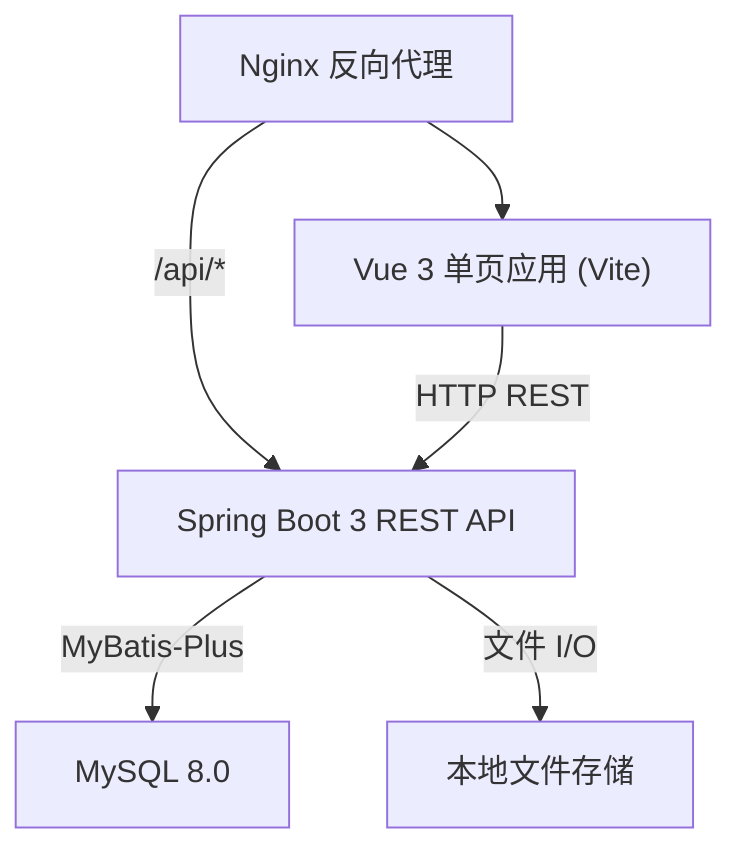
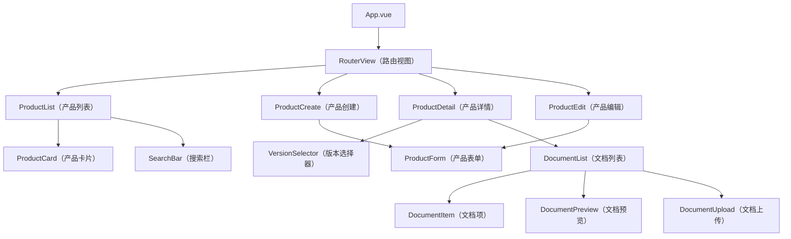
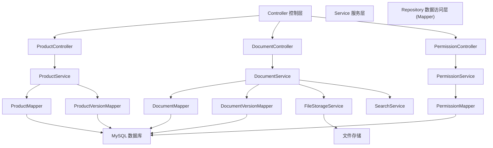
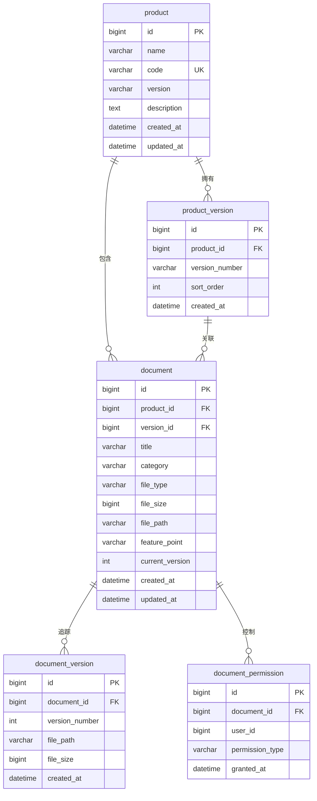

# 产品管理 - 技术设计

功能名称: product-management
更新日期: 2026-07-16

## 概述

产品管理系统，为企业提供产品/微服务模块的全生命周期管理，涵盖产品信息管理、版本管理和产品文档管理。系统采用前后端分离架构，支持文档上传、在线预览、全文搜索和权限控制。

## 系统架构

### 系统架构图



### 前端组件树



### 后端模块结构



## 组件与接口

### 前端路由

| 路由 | 组件 | 说明 |
|-------|-----------|-------------|
| `/products` | ProductList | 产品列表页，以卡片网格展示 |
| `/products/create` | ProductCreate | 产品创建表单页 |
| `/products/:id` | ProductDetail | 产品详情页，含文档列表 |
| `/products/:id/edit` | ProductEdit | 产品编辑表单页 |

### 前端组件

| 组件 | Props | Events | 说明 |
|-----------|-------|--------|-------------|
| ProductCard | `product: Product` | `@click` | 产品卡片，展示名称、编码、版本、描述 |
| ProductForm | `product?: Product`, `mode: 'create'\|'edit'` | `@submit`, `@cancel` | 产品创建/编辑表单 |
| VersionSelector | `versions: Version[]`, `current: Version` | `@change` | 版本切换下拉选择器 |
| DocumentList | `productId: number`, `versionId: number` | `@preview`, `@upload`, `@search` | 文档列表，按分类分组展示 |
| DocumentPreview | `document: Document` | `@close` | 文档预览弹窗，支持最大化/还原 |
| DocumentUpload | `productId: number`, `versionId: number` | `@uploaded` | 文档上传弹窗，含分类选择 |
| SearchBar | `placeholder: string` | `@search` | 搜索输入框，含防抖 |

### REST API 端点

#### 产品管理

| 方法 | 路径 | 请求体 | 响应 | 说明 |
|--------|------|-------------|----------|-------------|
| GET | `/api/products` | - | `PageResult<Product>` | 分页获取产品列表 |
| GET | `/api/products/:id` | - | `ProductDetailVO` | 获取产品详情（含当前版本和文档） |
| POST | `/api/products` | `ProductCreateDTO` | `Product` | 创建产品 |
| PUT | `/api/products/:id` | `ProductUpdateDTO` | `Product` | 更新产品 |
| DELETE | `/api/products/:id` | - | - | 删除产品 |
| GET | `/api/products/:id/versions` | - | `List<ProductVersion>` | 获取产品版本列表 |
| POST | `/api/products/:id/versions` | `VersionCreateDTO` | `ProductVersion` | 创建产品版本 |

#### 文档管理

| 方法 | 路径 | 请求体 | 响应 | 说明 |
|--------|------|-------------|----------|-------------|
| POST | `/api/documents/upload` | `multipart/form-data` | `Document` | 上传文档 |
| GET | `/api/documents/search` | 查询参数 | `PageResult<Document>` | 搜索文档 |
| GET | `/api/documents/:id` | - | `DocumentVO` | 获取文档详情 |
| GET | `/api/documents/:id/preview` | - | `stream` | 流式传输文档用于预览 |
| DELETE | `/api/documents/:id` | - | - | 删除文档 |
| GET | `/api/documents/:id/versions` | - | `List<DocumentVersion>` | 文档版本历史 |
| POST | `/api/documents/:id/versions` | `multipart/form-data` | `DocumentVersion` | 上传文档新版本 |
| PUT | `/api/documents/:id/permissions` | `PermissionUpdateDTO` | - | 更新文档权限 |
| GET | `/api/documents/:id/permissions` | - | `List<Permission>` | 获取文档权限列表 |

## 数据模型

### 数据库 ER 图



### 表结构定义

#### product（产品表）

| 列名 | 类型 | 约束 | 说明 |
|--------|------|------------|-------------|
| id | BIGINT | 主键, 自增 | 主键 |
| name | VARCHAR(100) | NOT NULL | 产品名称 |
| code | VARCHAR(50) | NOT NULL, UNIQUE | 产品编码 |
| version | VARCHAR(20) | NOT NULL | 当前版本号 |
| description | TEXT | - | 产品描述 |
| created_at | DATETIME | NOT NULL, DEFAULT NOW() | 创建时间 |
| updated_at | DATETIME | NOT NULL, DEFAULT NOW() ON UPDATE | 更新时间 |

#### product_version（产品版本表）

| 列名 | 类型 | 约束 | 说明 |
|--------|------|------------|-------------|
| id | BIGINT | 主键, 自增 | 主键 |
| product_id | BIGINT | 外键(product.id), NOT NULL | 所属产品 |
| version_number | VARCHAR(20) | NOT NULL | 版本号（如 1.0.0） |
| sort_order | INT | NOT NULL, DEFAULT 0 | 展示排序 |
| created_at | DATETIME | NOT NULL, DEFAULT NOW() | 创建时间 |

联合唯一约束: (product_id, version_number)

#### document（文档表）

| 列名 | 类型 | 约束 | 说明 |
|--------|------|------------|-------------|
| id | BIGINT | 主键, 自增 | 主键 |
| product_id | BIGINT | 外键(product.id), NOT NULL | 所属产品 |
| version_id | BIGINT | 外键(product_version.id), NOT NULL | 关联的产品版本 |
| title | VARCHAR(200) | NOT NULL | 文档标题 |
| category | VARCHAR(20) | NOT NULL | 分类：TECHNICAL 或 BUSINESS |
| file_type | VARCHAR(10) | NOT NULL | 文件扩展名：pdf, docx, md 等 |
| file_size | BIGINT | NOT NULL | 文件大小（字节） |
| file_path | VARCHAR(500) | NOT NULL | 文件系统存储路径 |
| feature_point | VARCHAR(200) | - | 可选的功能点关联 |
| current_version | INT | NOT NULL, DEFAULT 1 | 最新版本号 |
| created_at | DATETIME | NOT NULL, DEFAULT NOW() | 创建时间 |
| updated_at | DATETIME | NOT NULL, DEFAULT NOW() ON UPDATE | 更新时间 |

#### document_version（文档版本表）

| 列名 | 类型 | 约束 | 说明 |
|--------|------|------------|-------------|
| id | BIGINT | 主键, 自增 | 主键 |
| document_id | BIGINT | 外键(document.id), NOT NULL | 所属文档 |
| version_number | INT | NOT NULL | 版本序号 |
| file_path | VARCHAR(500) | NOT NULL | 该版本的存储路径 |
| file_size | BIGINT | NOT NULL | 文件大小（字节） |
| created_at | DATETIME | NOT NULL, DEFAULT NOW() | 创建时间 |

#### document_permission（文档权限表）

| 列名 | 类型 | 约束 | 说明 |
|--------|------|------------|-------------|
| id | BIGINT | 主键, 自增 | 主键 |
| document_id | BIGINT | 外键(document.id), NOT NULL | 所属文档 |
| user_id | BIGINT | NOT NULL | 用户标识 |
| permission_type | VARCHAR(10) | NOT NULL | 权限类型：READ 或 WRITE |
| granted_at | DATETIME | NOT NULL, DEFAULT NOW() | 授权时间 |

联合唯一约束: (document_id, user_id)

### 文件存储结构

```
/data/files/
  products/
    {product_code}/
      documents/
        {document_id}/
          v1/
            document.pdf
          v2/
            document.pdf
```

### 索引设计

| 表 | 索引名称 | 列 | 类型 |
|-------|-----------|---------|------|
| product | idx_product_code | code | UNIQUE |
| product | idx_product_name | name | NORMAL |
| product_version | idx_version_product | product_id, sort_order | NORMAL |
| document | idx_doc_product | product_id, version_id | NORMAL |
| document | idx_doc_category | category | NORMAL |
| document | idx_doc_title_fulltext | title | FULLTEXT |
| document_version | idx_docver_document | document_id, version_number | NORMAL |
| document_permission | idx_perm_document_user | document_id, user_id | UNIQUE |

## 正确性属性

### 不变式

1. **产品编码唯一性**：每个产品编码在整个系统中 MUST（必须）唯一。
2. **版本号唯一性**：每个版本号在单个产品内 MUST（必须）唯一。
3. **文档版本线性递增**：文档版本号 MUST（必须）在每次新上传时单调递增（同一文档内无间隙、无重复）。
4. **文档-产品关联性**：每个文档 MUST（必须）关联到恰好一个产品和一个产品版本。
5. **文件路径引用完整性**：存储在 `document.file_path` 和 `document_version.file_path` 中的路径 MUST（必须）指向文件系统上实际存在的文件。
6. **权限排他性**：对于任意 (document_id, user_id) 对，MAY（至多）存在一条权限记录。

### 事务边界

- 产品创建 + 初始版本创建 SHALL（应当）在单个事务中执行。
- 文档上传 + 文件系统写入 + document_version 插入 SHALL（应当）作为原子操作执行；数据库失败时回滚文件系统变更。
- 文档删除 SHALL（应当）级联删除所有关联的 document_version 记录和物理文件。

### 并发控制

- 产品编码唯一性通过数据库级别的 UNIQUE 约束强制执行。
- 同一文档的并发上传通过 `document_version` 插入约束序列化处理。
- 产品和文档更新使用 `updated_at` 时间戳实现乐观锁。

## 错误处理

### HTTP 状态码

| 场景 | 状态码 | 错误码 | 消息 |
|----------|--------|------|---------|
| 校验失败 | 400 | VALIDATION_ERROR | 具体字段校验错误消息 |
| 产品编码重复 | 409 | PRODUCT_CODE_DUPLICATE | 产品编码已存在 |
| 产品未找到 | 404 | PRODUCT_NOT_FOUND | 未找到 id 为 {id} 的产品 |
| 文档未找到 | 404 | DOCUMENT_NOT_FOUND | 未找到 id 为 {id} 的文档 |
| 不支持的文件类型 | 400 | UNSUPPORTED_FILE_TYPE | 文件类型 {type} 不受支持 |
| 文件大小超限 | 400 | FILE_SIZE_EXCEEDED | 文件大小超出 50MB 限制 |
| 权限不足 | 403 | PERMISSION_DENIED | 权限不足 |
| 文件存储失败 | 500 | FILE_STORAGE_ERROR | 存储上传文件失败 |
| 内部服务器错误 | 500 | INTERNAL_ERROR | 发生了意外错误 |

### API 错误响应格式

```json
{
  "code": "PRODUCT_CODE_DUPLICATE",
  "message": "产品编码已存在",
  "timestamp": "2026-07-16T10:30:00Z",
  "details": {
    "field": "code",
    "value": "EXISTING_CODE"
  }
}
```

### 前端错误处理策略

- Axios 拦截器 SHALL（应当）捕获所有 HTTP 错误并通过 Element Plus 的 `ElMessage` 显示用户友好提示消息。
- 网络错误（超时、连接被拒绝）SHALL（应当）显示通用重试提示。
- 文件上传失败 SHALL（应当）提供具体的错误消息（格式、大小、网络）。
- 权限错误 SHALL（应当）重定向未授权用户并显示访问被拒绝界面。

## 测试策略

### 后端测试

| 层级 | 工具 | 覆盖率目标 | 关注点 |
|-------|------|-----------------|-------|
| 单元测试 | JUnit 5 + Mockito | 80%+ | Service 层业务逻辑 |
| 数据层测试 | MyBatis-Plus Test | 90%+ | Mapper SQL 正确性 |
| 集成测试 | Spring Boot Test + TestContainers | 关键场景 | API 端点行为、事务边界 |
| API 测试 | MockMvc | 所有端点 | 请求校验、响应格式、错误处理 |

### 前端测试

| 层级 | 工具 | 覆盖率目标 | 关注点 |
|-------|------|-----------------|-------|
| 单元测试 | Vitest + Vue Test Utils | 70%+ | 组件渲染、Store 操作 |
| E2E 测试 | Playwright | 核心流程 | 产品 CRUD、文档上传、预览 |

### 核心测试场景

1. 使用重复编码创建产品 → 期望 409
2. 上传不支持的格式文档 → 期望 400
3. 上传超出大小限制的文档 → 期望 400
4. 无权限用户查看文档 → 期望 403
5. 并发上传文档版本 → 期望版本号顺序递增
6. 切换产品版本 → 期望文档列表正确刷新
7. PDF/Markdown/Word 文档预览 → 期望正确渲染内容
8. 按关键词全文搜索 → 期望返回匹配的文档
9. 空产品列表 → 期望显示空状态占位
10. 上传期间网络故障 → 期望显示用户友好的错误消息

## 技术栈

| 层级 | 技术 | 版本 | 用途 |
|-------|-----------|---------|---------|
| 前端框架 | Vue 3 | 3.x | UI 框架 |
| 构建工具 | Vite | 5.x | 前端构建与开发服务器 |
| UI 组件库 | Element Plus | 2.x | UI 组件 |
| 状态管理 | Pinia | 2.x | 客户端状态管理 |
| 路由 | Vue Router | 4.x | SPA 路由 |
| HTTP 客户端 | Axios | 1.x | API 通信 |
| 前端语言 | TypeScript | 5.x | 类型安全 |
| 后端框架 | Spring Boot | 3.x | REST API 服务器 |
| ORM | MyBatis-Plus | 3.5.x | 数据库访问 |
| 数据库 | MySQL | 8.0 | 数据持久化 |
| 后端构建工具 | Maven | 3.x | 依赖管理 |
| 后端语言 | Java | 17 | 运行时 |
| API 文档 | Knife4j (Swagger) | 4.x | API 文档生成 |
| 文件处理 | Apache POI / PDFBox | latest | 文档解析与预览 |
