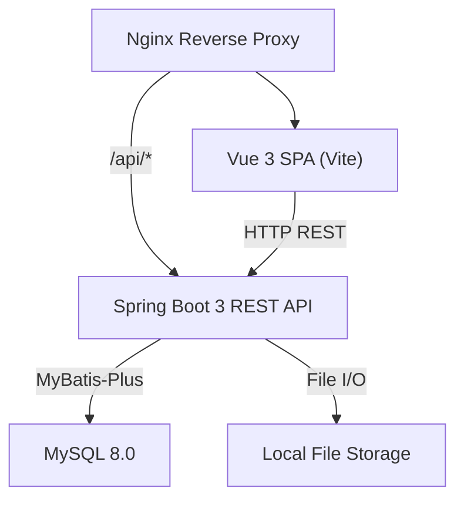
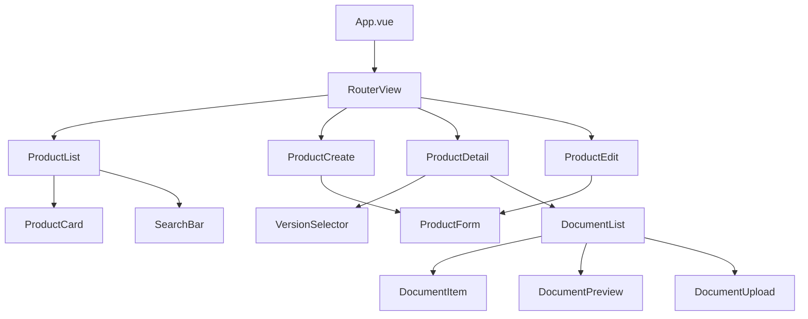
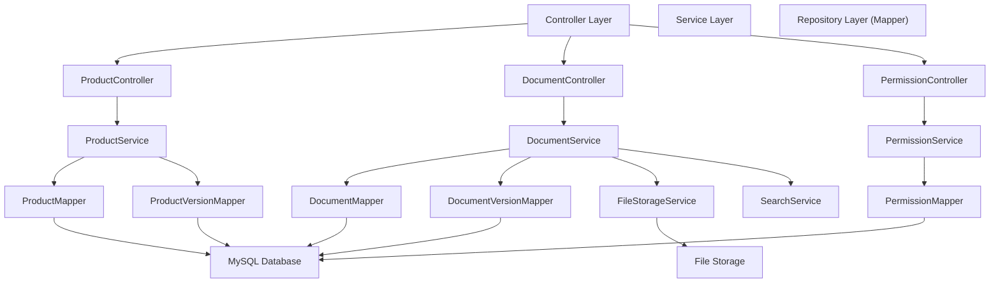
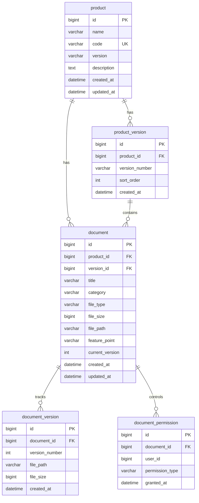

# Product Management - Technical Design

Feature Name: product-management
Updated: 2026-07-16

## Description

产品管理系统，为企业提供产品/微服务模块的全生命周期管理，涵盖产品信息管理、版本管理和产品文档管理。系统采用前后端分离架构，支持文档上传、在线预览、全文搜索和权限控制。

## Architecture

### System Architecture



### Frontend Component Tree



### Backend Module Structure



## Components and Interfaces

### Frontend Routes

| Route | Component | Description |
|-------|-----------|-------------|
| `/products` | ProductList | Product list page with card grid |
| `/products/create` | ProductCreate | Product creation form |
| `/products/:id` | ProductDetail | Product detail with document list |
| `/products/:id/edit` | ProductEdit | Product editing form |

### Frontend Components

| Component | Props | Events | Description |
|-----------|-------|--------|-------------|
| ProductCard | `product: Product` | `@click` | Product card with name, code, version, description |
| ProductForm | `product?: Product`, `mode: 'create'\|'edit'` | `@submit`, `@cancel` | Product create/edit form |
| VersionSelector | `versions: Version[]`, `current: Version` | `@change` | Version switch dropdown |
| DocumentList | `productId: number`, `versionId: number` | `@preview`, `@upload`, `@search` | Document list grouped by category |
| DocumentPreview | `document: Document` | `@close` | Document preview dialog with maximize/restore |
| DocumentUpload | `productId: number`, `versionId: number` | `@uploaded` | Document upload dialog with category selection |
| SearchBar | `placeholder: string` | `@search` | Search input with debounce |

### REST API Endpoints

#### Product Management

| Method | Path | Request Body | Response | Description |
|--------|------|-------------|----------|-------------|
| GET | `/api/products` | - | `PageResult<Product>` | List products with pagination |
| GET | `/api/products/:id` | - | `ProductDetailVO` | Get product with current version and documents |
| POST | `/api/products` | `ProductCreateDTO` | `Product` | Create product |
| PUT | `/api/products/:id` | `ProductUpdateDTO` | `Product` | Update product |
| DELETE | `/api/products/:id` | - | - | Delete product |
| GET | `/api/products/:id/versions` | - | `List<ProductVersion>` | List product versions |
| POST | `/api/products/:id/versions` | `VersionCreateDTO` | `ProductVersion` | Create product version |

#### Document Management

| Method | Path | Request Body | Response | Description |
|--------|------|-------------|----------|-------------|
| POST | `/api/documents/upload` | `multipart/form-data` | `Document` | Upload document |
| GET | `/api/documents/search` | query params | `PageResult<Document>` | Search documents |
| GET | `/api/documents/:id` | - | `DocumentVO` | Get document detail |
| GET | `/api/documents/:id/preview` | - | `stream` | Stream document for preview |
| DELETE | `/api/documents/:id` | - | - | Delete document |
| GET | `/api/documents/:id/versions` | - | `List<DocumentVersion>` | Document version history |
| POST | `/api/documents/:id/versions` | `multipart/form-data` | `DocumentVersion` | Upload new document version |
| PUT | `/api/documents/:id/permissions` | `PermissionUpdateDTO` | - | Update document permissions |
| GET | `/api/documents/:id/permissions` | - | `List<Permission>` | Get document permissions |

## Data Models

### Database ER Diagram



### Table Definitions

#### product (产品表)

| Column | Type | Constraint | Description |
|--------|------|------------|-------------|
| id | BIGINT | PK, AUTO_INCREMENT | Primary key |
| name | VARCHAR(100) | NOT NULL | Product name |
| code | VARCHAR(50) | NOT NULL, UNIQUE | Product code |
| version | VARCHAR(20) | NOT NULL | Current version number |
| description | TEXT | - | Product description |
| created_at | DATETIME | NOT NULL, DEFAULT NOW() | Creation time |
| updated_at | DATETIME | NOT NULL, DEFAULT NOW() ON UPDATE | Update time |

#### product_version (产品版本表)

| Column | Type | Constraint | Description |
|--------|------|------------|-------------|
| id | BIGINT | PK, AUTO_INCREMENT | Primary key |
| product_id | BIGINT | FK(product.id), NOT NULL | Product reference |
| version_number | VARCHAR(20) | NOT NULL | Version number (e.g., 1.0.0) |
| sort_order | INT | NOT NULL, DEFAULT 0 | Sort order for display |
| created_at | DATETIME | NOT NULL, DEFAULT NOW() | Creation time |

Unique constraint: (product_id, version_number)

#### document (文档表)

| Column | Type | Constraint | Description |
|--------|------|------------|-------------|
| id | BIGINT | PK, AUTO_INCREMENT | Primary key |
| product_id | BIGINT | FK(product.id), NOT NULL | Product reference |
| version_id | BIGINT | FK(product_version.id), NOT NULL | Associated product version |
| title | VARCHAR(200) | NOT NULL | Document title |
| category | VARCHAR(20) | NOT NULL | Category: TECHNICAL or BUSINESS |
| file_type | VARCHAR(10) | NOT NULL | File extension: pdf, docx, md, etc |
| file_size | BIGINT | NOT NULL | File size in bytes |
| file_path | VARCHAR(500) | NOT NULL | Storage path on filesystem |
| feature_point | VARCHAR(200) | - | Optional feature point association |
| current_version | INT | NOT NULL, DEFAULT 1 | Latest version number |
| created_at | DATETIME | NOT NULL, DEFAULT NOW() | Creation time |
| updated_at | DATETIME | NOT NULL, DEFAULT NOW() ON UPDATE | Update time |

#### document_version (文档版本表)

| Column | Type | Constraint | Description |
|--------|------|------------|-------------|
| id | BIGINT | PK, AUTO_INCREMENT | Primary key |
| document_id | BIGINT | FK(document.id), NOT NULL | Document reference |
| version_number | INT | NOT NULL | Version sequence number |
| file_path | VARCHAR(500) | NOT NULL | Storage path for this version |
| file_size | BIGINT | NOT NULL | File size in bytes |
| created_at | DATETIME | NOT NULL, DEFAULT NOW() | Creation time |

#### document_permission (文档权限表)

| Column | Type | Constraint | Description |
|--------|------|------------|-------------|
| id | BIGINT | PK, AUTO_INCREMENT | Primary key |
| document_id | BIGINT | FK(document.id), NOT NULL | Document reference |
| user_id | BIGINT | NOT NULL | User identifier |
| permission_type | VARCHAR(10) | NOT NULL | READ or WRITE |
| granted_at | DATETIME | NOT NULL, DEFAULT NOW() | Grant time |

Unique constraint: (document_id, user_id)

### File Storage Schema

```
/data/files/
  products/
    {product_code}/
      documents/
        {document_id}/
          v1/
            document.pdf
          v2/
            document.pdf
```

### Index Design

| Table | Index Name | Columns | Type |
|-------|-----------|---------|------|
| product | idx_product_code | code | UNIQUE |
| product | idx_product_name | name | NORMAL |
| product_version | idx_version_product | product_id, sort_order | NORMAL |
| document | idx_doc_product | product_id, version_id | NORMAL |
| document | idx_doc_category | category | NORMAL |
| document | idx_doc_title_fulltext | title | FULLTEXT |
| document_version | idx_docver_document | document_id, version_number | NORMAL |
| document_permission | idx_perm_document_user | document_id, user_id | UNIQUE |

## Correctness Properties

### Invariants

1. **Product Code Uniqueness**: Each product code MUST be unique across the system.
2. **Version Number Uniqueness**: Each version_number MUST be unique within a single product.
3. **Document Version Linearity**: Document version numbers MUST increase monotonically with each new upload (no gaps or duplicates within the same document).
4. **Document-Product Association**: Every document MUST be associated with exactly one product and one product version.
5. **File Path Referential Integrity**: The file_path stored in `document.file_path` and `document_version.file_path` MUST point to an existing file on the filesystem.
6. **Permission Exclusivity**: For any (document_id, user_id) pair, at most one permission record MAY exist.

### Transactional Boundaries

- Product creation + initial version creation SHALL execute in a single transaction.
- Document upload + file system write + document_version insert SHALL execute as an atomic operation; rollback file system changes on database failure.
- Document deletion SHALL cascade delete all associated document_version records and files.

### Concurrency

- Product code uniqueness is enforced at the database level via UNIQUE constraint.
- Concurrent document uploads for the same document are serialized via the `document_version` insertion constraint.
- Optimistic locking using `updated_at` timestamp for product and document updates.

## Error Handling

### HTTP Status Codes

| Scenario | Status | Code | Message |
|----------|--------|------|---------|
| Validation failure | 400 | VALIDATION_ERROR | Specific field validation message |
| Product code duplicate | 409 | PRODUCT_CODE_DUPLICATE | Product code already exists |
| Product not found | 404 | PRODUCT_NOT_FOUND | Product with id {id} not found |
| Document not found | 404 | DOCUMENT_NOT_FOUND | Document with id {id} not found |
| Unsupported file type | 400 | UNSUPPORTED_FILE_TYPE | File type {type} is not supported |
| File size exceeded | 400 | FILE_SIZE_EXCEEDED | File size exceeds 50MB limit |
| Permission denied | 403 | PERMISSION_DENIED | Insufficient permissions |
| File storage failure | 500 | FILE_STORAGE_ERROR | Failed to store uploaded file |
| Internal server error | 500 | INTERNAL_ERROR | An unexpected error occurred |

### API Error Response Format

```json
{
  "code": "PRODUCT_CODE_DUPLICATE",
  "message": "Product code already exists",
  "timestamp": "2026-07-16T10:30:00Z",
  "details": {
    "field": "code",
    "value": "EXISTING_CODE"
  }
}
```

### Frontend Error Handling Strategy

- Axios interceptor SHALL capture all HTTP errors and display user-friendly messages via Element Plus `ElMessage`.
- Network errors (timeout, connection refused) SHALL display a generic retry prompt.
- File upload failures SHALL provide specific error messaging (format, size, network).
- Permission errors SHALL redirect unauthorized users and display access-denied UI.

## Test Strategy

### Backend Testing

| Layer | Tool | Coverage Target | Focus |
|-------|------|-----------------|-------|
| Unit | JUnit 5 + Mockito | 80%+ | Service layer business logic |
| Repository | MyBatis-Plus Test | 90%+ | Mapper SQL correctness |
| Integration | Spring Boot Test + TestContainers | Key scenarios | API endpoint behavior, transactional boundaries |
| API | MockMvc | All endpoints | Request validation, response format, error handling |

### Frontend Testing

| Layer | Tool | Coverage Target | Focus |
|-------|------|-----------------|-------|
| Unit | Vitest + Vue Test Utils | 70%+ | Component rendering, store actions |
| E2E | Playwright | Core flows | Product CRUD, document upload, preview |

### Key Test Scenarios

1. Create product with duplicate code EXPECT 409
2. Upload document with unsupported format EXPECT 400
3. Upload document exceeding size limit EXPECT 400
4. View document without permission EXPECT 403
5. Concurrent document version upload EXPECT sequential version numbers
6. Product version switch EXPECT correct document list refresh
7. Document preview for PDF/Markdown/Word EXPECT rendered content
8. Full-text search by keyword EXPECT matching documents returned
9. Empty product list EXPECT empty state placeholder
10. Network failure during upload EXPECT user-friendly error message

## Technology Stack

| Layer | Technology | Version | Purpose |
|-------|-----------|---------|---------|
| Frontend Framework | Vue 3 | 3.x | UI framework |
| Build Tool | Vite | 5.x | Frontend build and dev server |
| UI Library | Element Plus | 2.x | UI components |
| State Management | Pinia | 2.x | Client-side state |
| Router | Vue Router | 4.x | SPA routing |
| HTTP Client | Axios | 1.x | API communication |
| Language (Frontend) | TypeScript | 5.x | Type safety |
| Backend Framework | Spring Boot | 3.x | REST API server |
| ORM | MyBatis-Plus | 3.5.x | Database access |
| Database | MySQL | 8.0 | Data persistence |
| Build Tool (Backend) | Maven | 3.x | Dependency management |
| Language (Backend) | Java | 17 | Runtime |
| API Documentation | Knife4j (Swagger) | 4.x | API docs |
| File Processing | Apache POI / PDFBox | latest | Document parsing |
