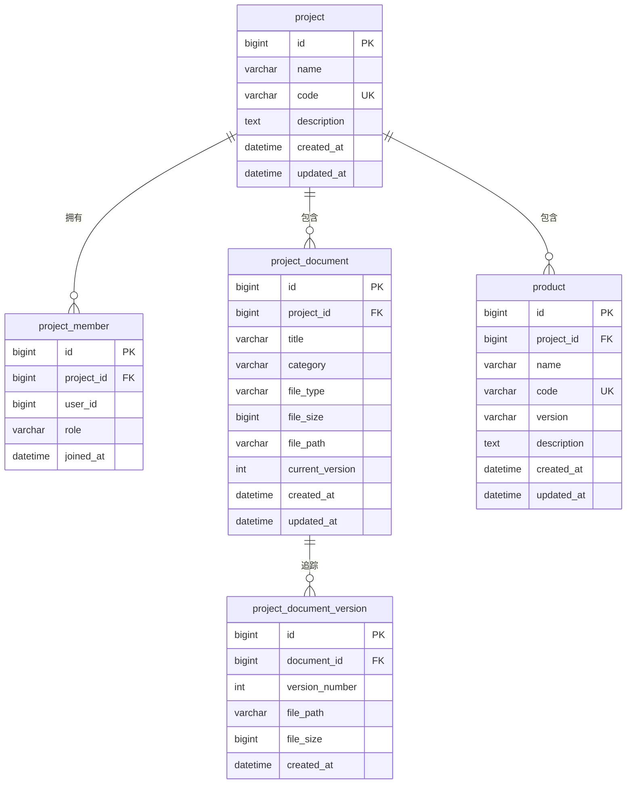
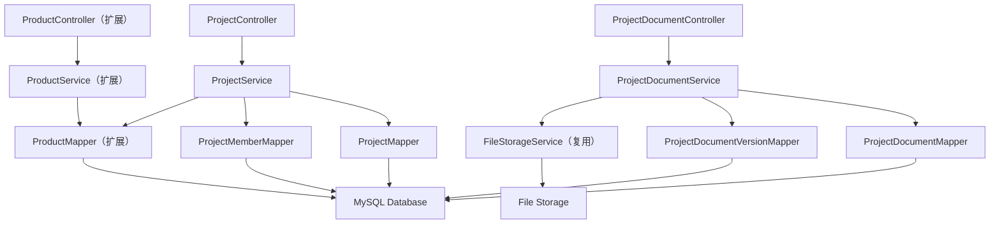

# 项目管理 - 技术设计

功能名称: project-management
更新日期: 2026-07-16

## 概述

项目管理系统，在现有产品管理系统之上增加项目层级的组织能力。一个项目包含多个产品，支持项目信息维护、成员管理和独立的项目文档管理。系统基于现有技术栈进行增量开发，最大化复用已有服务和组件。

## 与现有系统的集成关系

### 数据模型扩展

现有 `product` 表增加 `project_id` 外键字段，建立项目与产品的父子关系。项目文档使用独立的 `project_document` 和 `project_document_version` 表，保持与产品文档体系结构一致但数据隔离。



### 架构扩展



## 数据模型

### project（项目表）

| 列名 | 类型 | 约束 | 说明 |
|--------|------|------------|-------------|
| id | BIGINT | 主键, 自增 | 主键 |
| name | VARCHAR(100) | NOT NULL | 项目名称 |
| code | VARCHAR(50) | NOT NULL, UNIQUE | 项目编码 |
| description | TEXT | - | 项目描述 |
| created_at | DATETIME | NOT NULL, DEFAULT NOW() | 创建时间 |
| updated_at | DATETIME | NOT NULL, DEFAULT NOW() ON UPDATE | 更新时间 |

### project_member（项目成员表）

| 列名 | 类型 | 约束 | 说明 |
|--------|------|------------|-------------|
| id | BIGINT | 主键, 自增 | 主键 |
| project_id | BIGINT | 外键(project.id), NOT NULL | 所属项目 |
| user_id | BIGINT | NOT NULL | 用户 ID |
| role | VARCHAR(20) | NOT NULL | 角色：OWNER, DEVELOPER, OBSERVER |
| joined_at | DATETIME | NOT NULL, DEFAULT NOW() | 加入时间 |

联合唯一约束: (project_id, user_id)

### project_document（项目文档表）

| 列名 | 类型 | 约束 | 说明 |
|--------|------|------------|-------------|
| id | BIGINT | 主键, 自增 | 主键 |
| project_id | BIGINT | 外键(project.id), NOT NULL | 所属项目 |
| title | VARCHAR(200) | NOT NULL | 文档标题 |
| category | VARCHAR(20) | NOT NULL | 分类：TECHNICAL 或 BUSINESS |
| file_type | VARCHAR(10) | NOT NULL | 文件扩展名 |
| file_size | BIGINT | NOT NULL | 文件大小（字节） |
| file_path | VARCHAR(500) | NOT NULL | 存储路径 |
| current_version | INT | NOT NULL, DEFAULT 1 | 最新版本号 |
| created_at | DATETIME | NOT NULL, DEFAULT NOW() | 创建时间 |
| updated_at | DATETIME | NOT NULL, DEFAULT NOW() ON UPDATE | 更新时间 |

### project_document_version（项目文档版本表）

| 列名 | 类型 | 约束 | 说明 |
|--------|------|------------|-------------|
| id | BIGINT | 主键, 自增 | 主键 |
| document_id | BIGINT | 外键(project_document.id), NOT NULL | 所属文档 |
| version_number | INT | NOT NULL | 版本序号 |
| file_path | VARCHAR(500) | NOT NULL | 该版本的存储路径 |
| file_size | BIGINT | NOT NULL | 文件大小（字节） |
| created_at | DATETIME | NOT NULL, DEFAULT NOW() | 创建时间 |

联合唯一约束: (document_id, version_number)

### product 表扩展

在现有 product 表上新增字段：

| 列名 | 类型 | 约束 | 说明 |
|--------|------|------------|-------------|
| project_id | BIGINT | 外键(project.id) | 所属项目，可为空表示未分配 |

## API 端点

### 项目管理

| 方法 | 路径 | 请求体 | 响应 | 说明 |
|--------|------|-------------|----------|-------------|
| GET | `/api/projects` | - | `PageResult<Project>` | 分页获取项目列表 |
| GET | `/api/projects/:id` | - | `ProjectDetailVO` | 获取项目详情（含产品和成员） |
| POST | `/api/projects` | `ProjectCreateDTO` | `Project` | 创建项目 |
| PUT | `/api/projects/:id` | `ProjectUpdateDTO` | `Project` | 更新项目 |
| DELETE | `/api/projects/:id` | - | - | 删除项目（需无产品关联） |

### 产品关联

| 方法 | 路径 | 请求体 | 响应 | 说明 |
|--------|------|-------------|----------|-------------|
| GET | `/api/projects/:id/products` | - | `List<Product>` | 获取项目下的产品列表 |
| POST | `/api/projects/:id/products` | `{ productId }` | `Product` | 添加产品到项目 |
| DELETE | `/api/projects/:id/products/:productId` | - | - | 从项目移除产品 |

### 成员管理

| 方法 | 路径 | 请求体 | 响应 | 说明 |
|--------|------|-------------|----------|-------------|
| GET | `/api/projects/:id/members` | - | `List<ProjectMember>` | 获取项目成员列表 |
| POST | `/api/projects/:id/members` | `{ userId, role }` | `ProjectMember` | 添加项目成员 |
| PUT | `/api/projects/:id/members/:userId` | `{ role }` | `ProjectMember` | 修改成员角色 |
| DELETE | `/api/projects/:id/members/:userId` | - | - | 移除项目成员 |

### 项目文档

| 方法 | 路径 | 请求体 | 响应 | 说明 |
|--------|------|-------------|----------|-------------|
| POST | `/api/projects/:id/documents/upload` | `multipart/form-data` | `ProjectDocument` | 上传项目文档 |
| GET | `/api/projects/:id/documents` | - | `List<ProjectDocument>` | 获取项目文档列表 |
| GET | `/api/projects/:id/documents/search` | 查询参数 | `PageResult<ProjectDocument>` | 搜索项目文档 |
| GET | `/api/documents/project/:id` | - | `ProjectDocument` | 获取项目文档详情 |
| GET | `/api/documents/project/:id/preview` | - | `stream` | 预览项目文档 |
| DELETE | `/api/documents/project/:id` | - | - | 删除项目文档 |
| GET | `/api/documents/project/:id/versions` | - | `List<ProjectDocumentVersion>` | 文档版本历史 |
| POST | `/api/documents/project/:id/versions` | `multipart/form-data` | `ProjectDocumentVersion` | 上传文档新版本 |

## 前端设计

### 路由扩展

在现有路由基础上新增：

| 路由 | 组件 | 说明 |
|-------|-----------|-------------|
| `/projects` | ProjectList | 项目列表页 |
| `/projects/create` | ProjectCreate | 项目创建页 |
| `/projects/:id` | ProjectDetail | 项目详情页（含产品、成员、文档） |
| `/projects/:id/edit` | ProjectEdit | 项目编辑页 |

### 导航调整

在主布局中增加顶部导航或侧边栏，提供"产品管理"和"项目管理"两个入口。

```
App.vue
├── 顶部导航栏
│   ├── 产品管理 (/products)
│   └── 项目管理 (/projects)
└── RouterView
```

### 新增前端组件

| 组件 | Props | Events | 说明 |
|-----------|-------|--------|-------------|
| ProjectCard | `project: Project` | `@click` | 项目卡片 |
| ProjectForm | `project?: Project`, `mode` | `@submit`, `@cancel` | 项目创建/编辑表单 |
| ProductAssociation | `projectId: number` | `@change` | 产品关联管理面板 |
| MemberManager | `projectId: number` | `@change` | 成员管理面板 |
| ProjectDocumentList | `projectId: number` | - | 项目文档列表（复用已有文档组件模式） |

### 新增 Store

在现有 store 基础上新增 `useProjectStore`：

```
useProjectStore
├── projects: Project[]
├── currentProject: ProjectDetail | null
├── fetchProjects()
├── fetchProjectDetail(id)
├── createProject(data)
├── updateProject(id, data)
├── deleteProject(id)
├── addProduct(projectId, productId)
├── removeProduct(projectId, productId)
├── addMember(projectId, userId, role)
├── updateMemberRole(projectId, userId, role)
├── removeMember(projectId, userId)
└── fetchDocuments(projectId)
```

## 正确性属性

### 不变式

1. **项目编码唯一性**：每个项目编码在系统内 MUST（必须）唯一。
2. **产品归属唯一性**：每个产品至多归属于一个项目（product.project_id MAY 为 NULL 或唯一项目 ID）。
3. **成员关系唯一性**：对于任意 (project_id, user_id) 对，至多存在一条成员记录。
4. **删除约束**：项目下有产品关联时 MUST（必须）阻止删除操作。
5. **文档独立性**：项目文档与产品文档分别存储在不同表中，互不干扰。

### 事务边界

- 项目创建 SHALL（应当）在单个事务中执行。
- 产品关联/移除 SHALL（应当）作为原子操作，更新 product.project_id。
- 项目文档上传 SHALL（应当）复用 FileStorageService 的原子写入逻辑。
- 项目删除 SHALL（应当）级联删除成员、文档和文档版本（不影响产品本身）。

### 并发控制

- 项目编码唯一性通过数据库 UNIQUE 约束保证。
- product.project_id 更新使用乐观锁（updated_at 校验）。
- 成员 (project_id, user_id) 唯一性由数据库联合唯一约束保证。

## 错误处理

在现有 GlobalExceptionHandler 基础上新增：

| 场景 | 状态码 | 错误码 | 消息 |
|----------|--------|------|---------|
| 项目编码重复 | 409 | PROJECT_CODE_DUPLICATE | 项目编码已存在 |
| 项目未找到 | 404 | PROJECT_NOT_FOUND | 未找到该项目 |
| 项目有产品关联无法删除 | 400 | PROJECT_HAS_PRODUCTS | 项目下仍有产品，无法删除 |
| 产品已属于其他项目 | 409 | PRODUCT_ALREADY_ASSIGNED | 该产品已属于其他项目 |
| 成员已存在 | 409 | MEMBER_ALREADY_EXISTS | 该用户已是项目成员 |

## 文件存储扩展

项目文档使用独立存储路径，与产品文档隔离：

```
/data/files/
  projects/
    {project_code}/
      documents/
        {document_id}/
          v1/
            document.pdf
  products/
    {product_code}/
      documents/
        ...
```

## 测试策略

### 核心测试场景

1. 创建项目并添加产品 → 验证 product.project_id 正确更新
2. 产品已属于项目 A，尝试添加到项目 B → 期望 409
3. 项目有关联产品时删除 → 期望 400
4. 删除空项目 → 级联删除成员和文档
5. 项目文档上传/预览/搜索 → 与产品文档互不影响
6. 成员角色变更 → 验证角色正确更新
7. 同一用户重复添加 → 期望 409
